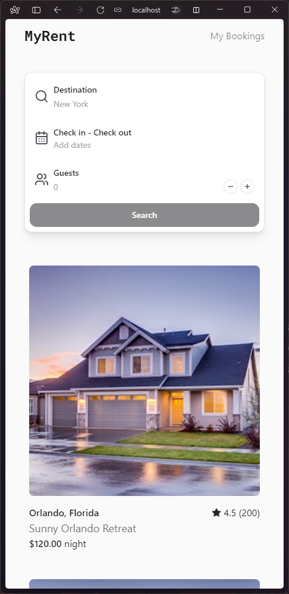

# MyRent

Hotels, homes, and vacation rentals

## [Demo link](https://myrent-react-app.vercel.app/)

|                                                      |                                                    |
| :--------------------------------------------------: | -------------------------------------------------- |
|  |  |

## Tech choices

- [Vite + React + SWC](https://vitejs.dev/)
- [TanStack Query](https://tanstack.com/query/latest/)
- [TanStack Router](https://tanstack.com/router/latest/)
- [Zustand](https://github.com/pmndrs/zustand)
- [Shadcn UI](https://ui.shadcn.com)
- [Zod](https://zod.dev)
- [TailwindCSS](https://tailwindcss.com/)
- [Cypress](https://cypress.io/)
- [Bun](https://bun.sh/)

## Architecture Overview

To be as close as possible to a real-world application, I have made architectural decisions similar to those I usually make, incorporating common practices and tools, but with slight differences.

### Framework and Routing

- **Vite**: Selected for project boilerplating due to its simplicity and speed. Vite offers a modern development environment that aligns with the project's goals.
- **TanStack Router**: Chosen for handling routing within the application. While TanStack Router provides the necessary functionality for this project, **Next.js** would be the preferred choice for a production-level project for its comprehensive features and SSR capabilities.

### State Management

- **Zustand**: Utilized for global state management. Zustand offers a straightforward setup compared to Redux, making it the ideal choice. The primary use case in this project is to manage bookings, with the added functionality of persisting these bookings in `localStorage`.
  - The global store is implemented in `src/hooks/use-global-store.ts`.

### Data Fetching and Management

- **TanStack Query**: Used for API data fetching management. Given the absence of a real remote API, the application simulates API calls using fake data from `src/fixtures/data.ts`.
- **API Interactions**: Despite the project not interacting with a real API, **TanStack Query** is also used to perform mutations in the Zustand store.\
  I like to keep queries and mutations in a two separate files, for me it enhances maintainability.
  - Queries: `src/hooks/use-queries.ts`
  - Mutations: `src/hooks/use-mutations.ts`

### Type Safety and Validation

- **Zod**: Integral for type declaration and form validation, ensuring the codebase remains fully type-safe. Zod's integration facilitates robust validation schemes and enhances the project's reliability.

### Styling

- **TailwindCSS**: Adopted for its utility-first approach to CSS, allowing for rapid UI development without sacrificing customization.
- **Shadcn UI**: Serves as the component library, with modifications to fit the project's design requirements. The combination of TailwindCSS and Shadcn UI provides a flexible and efficient styling solution.

### Conclusion

The architectural decisions taken for this project are a synergy between the best development practices and the efficiency of the development process. The project uses tools and libraries that provide simplicity, type safety, and modularity to build a scalable and maintainable architecture that can be used in real-world applications.

## Getting started

```
bun install
bun run dev
```

## Testing

```
bun run dev
bun cy:run
```


